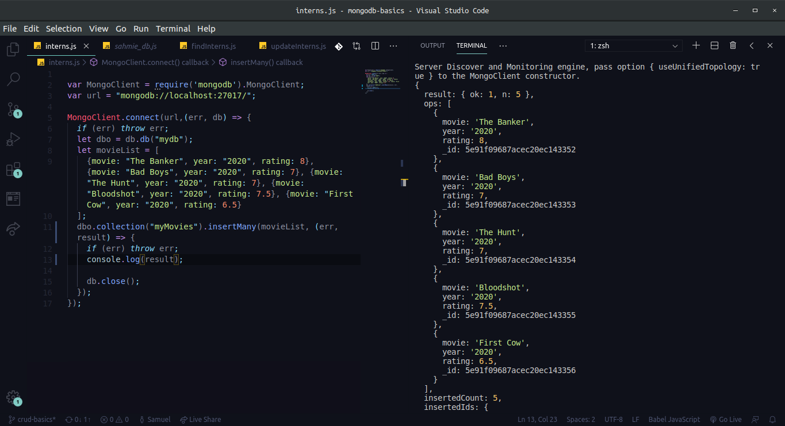
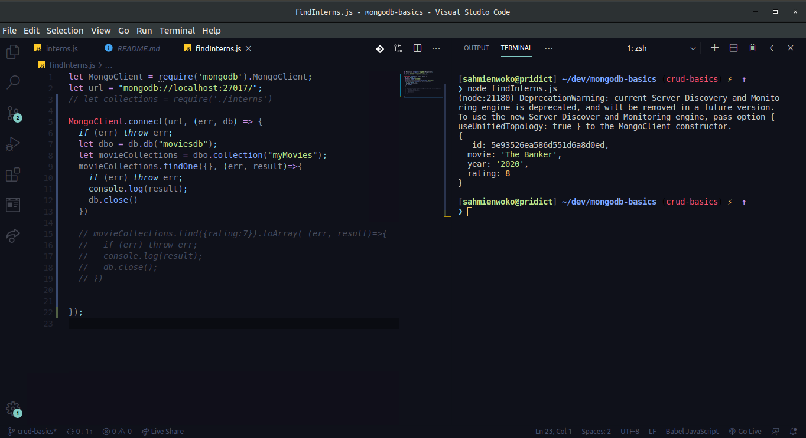
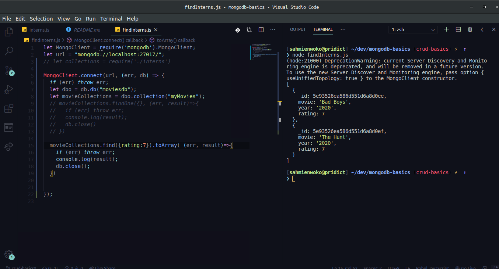
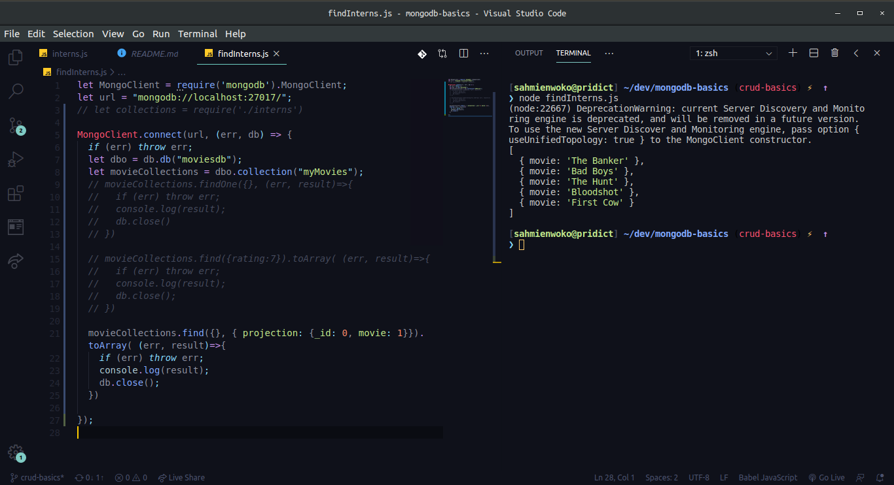
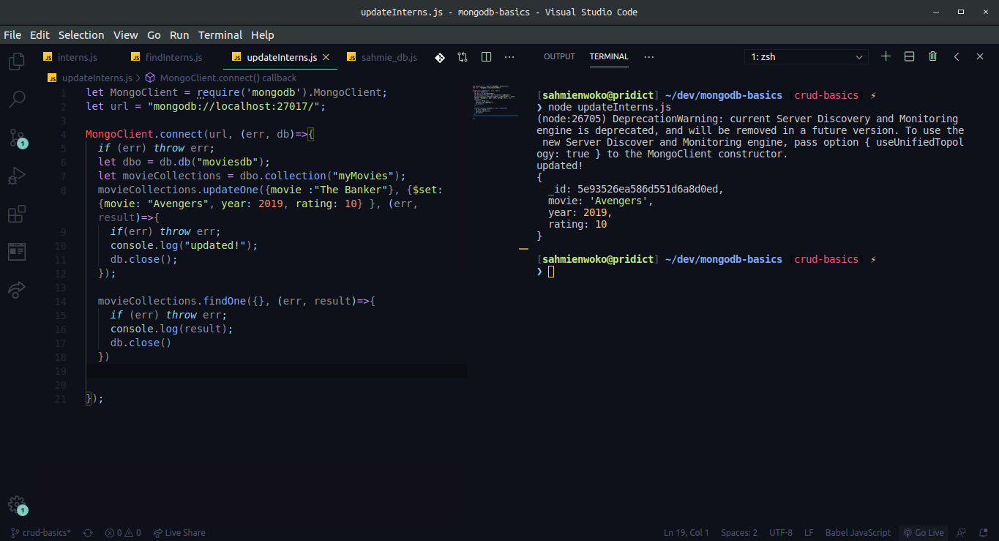

### 1. myMovies collection with documents inserted

### 2. write a function making use of appropriate methods and queries to return
### (a) The first document in the collection 

### (b) All movies with rating 7

### (c) Use a projection object to return only movie titles and nothing else. 

### 3. Update the movie with title "The Banker", to any movie of your choice

